# IS601-assignment-9-database
Containerized database services

## Docker services running output

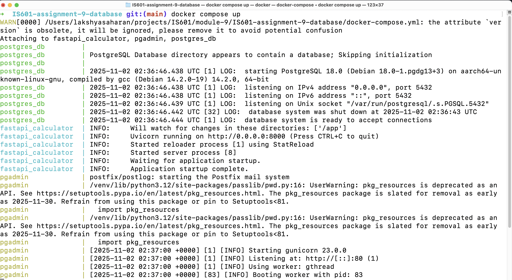

## Successfully started pgadmin server on local

The pgAdmin container is running successfully and accessible at `http://localhost:5050`
, confirming the database environment is set up correctly via Docker Compose.

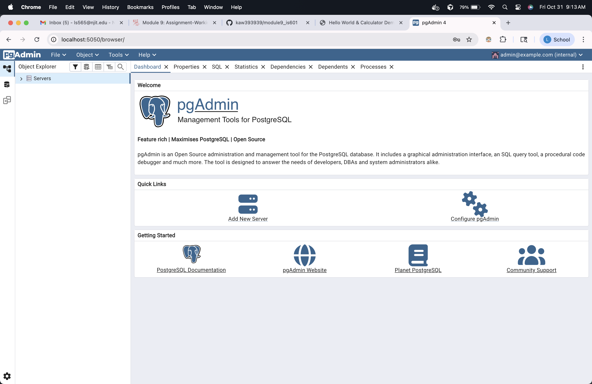

## Create table "users"

- Created the `users` table with columns for user information (username, email, created_at). 
- Each user gets a unique ID generated automatically.

Query:

```sql
CREATE TABLE users (
    id SERIAL PRIMARY KEY,
    username VARCHAR(50) NOT NULL UNIQUE,
    email VARCHAR(100) NOT NULL UNIQUE,
    created_at TIMESTAMP DEFAULT CURRENT_TIMESTAMP
);
```

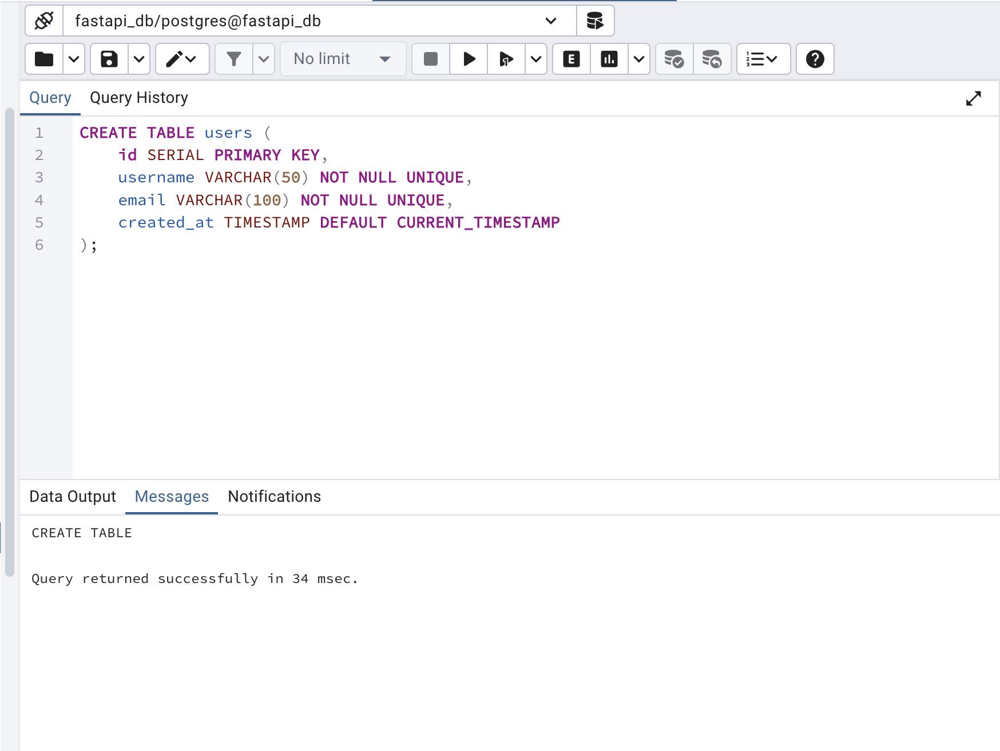

## Create table "calculations"

- Created the `calculations` table to store math operations performed by users. 
- It includes a **foreign key (user_id)** linking each calculation to a user, showing a one-to-many relationship.

Query:

```sql
CREATE TABLE calculations (
    id SERIAL PRIMARY KEY,
    operation VARCHAR(20) NOT NULL,
    operand_a FLOAT NOT NULL,
    operand_b FLOAT NOT NULL,
    result FLOAT NOT NULL,
    timestamp TIMESTAMP DEFAULT CURRENT_TIMESTAMP,
    user_id INTEGER NOT NULL,
    FOREIGN KEY (user_id) REFERENCES users(id) ON DELETE CASCADE
);
```


## Insert into both tables

- Inserted sample records into both tables. 
- Added two users (“alice” and “bob”) and multiple calculation records linked to them through **user_id**.

Query:

```sql
INSERT INTO users (username, email) 
VALUES 
('alice', 'alice@example.com'), 
('bob', 'bob@example.com');

INSERT INTO calculations (operation, operand_a, operand_b, result, user_id)
VALUES
('add', 2, 3, 5, 1),
('divide', 10, 2, 5, 1),
('multiply', 4, 5, 20, 2);
```


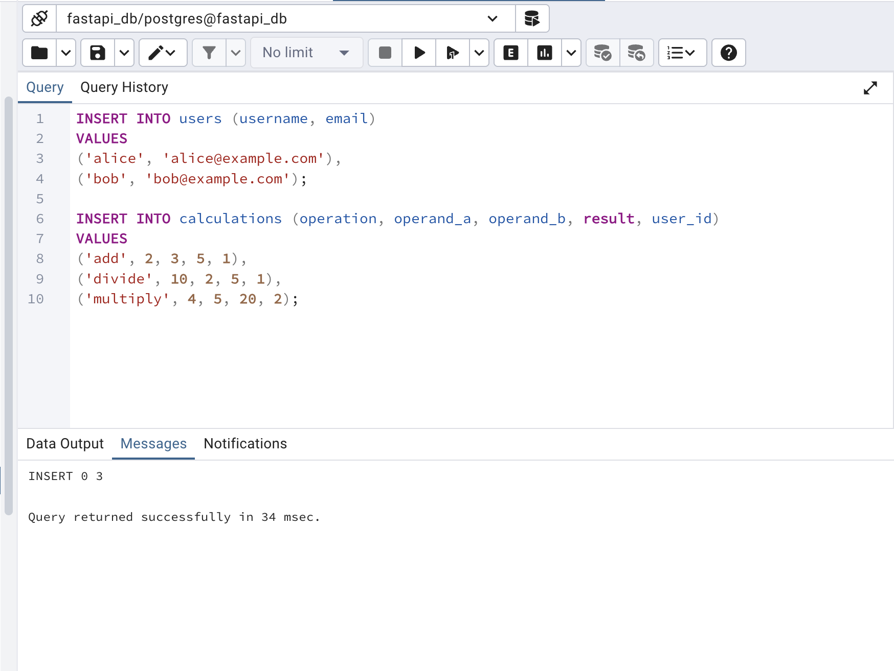

## Display "users" table data

-  Retrieved all rows from the `users` table to confirm data was inserted successfully.

Query:

```sql
-- Retrieve all users
SELECT * FROM users;
```

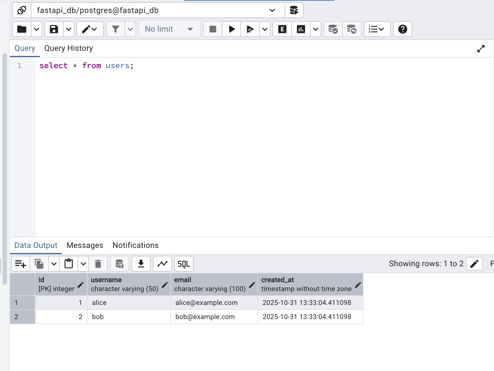

## Display "calculations" table data

- Retrieved all rows from the `calculations` table to verify inserted calculation records and confirm relationships with user IDs.

Query:

```sql
-- Retrieve all calculations
SELECT * FROM calculations;
```

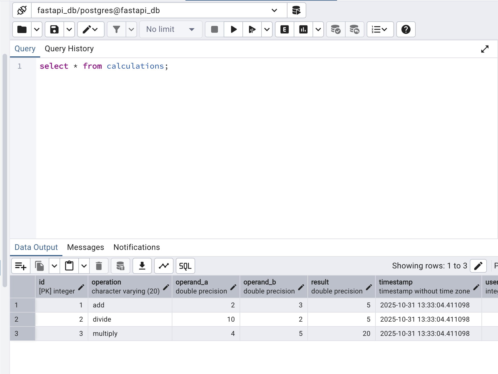

## Join "users" and "calculations" table

- Performed an **INNER JOIN** to display usernames along with their respective operations, operands, and results — showing how data from both tables is connected.

Query:

```sql
-- Join users and calculations
SELECT u.username, c.operation, c.operand_a, c.operand_b, c.result
FROM calculations c
JOIN users u ON c.user_id = u.id;
```

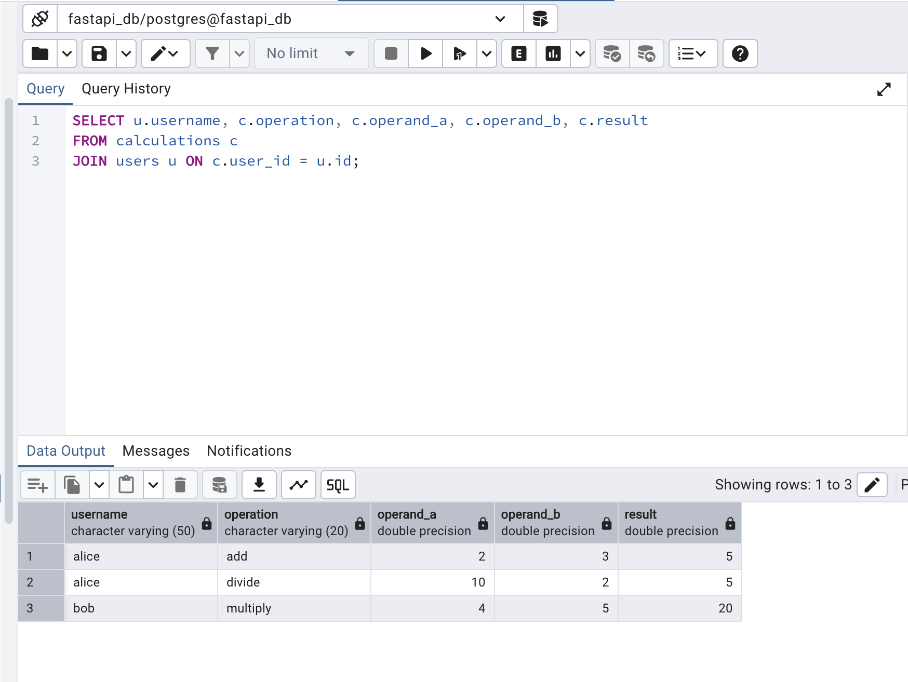

## Update inside "calculations" table

- Updated a calculation record to change its result value. This demonstrates the ability to modify existing data in the database.
- As you can see before and after the update, for ID=3, result got update to 99. Although mathemical result doesn't equal to 99 but this is just for demonstration.

Query:

```sql
UPDATE calculations
SET result = 99
WHERE id = 3;
```

### Before update


### Updating id=3 with result=99

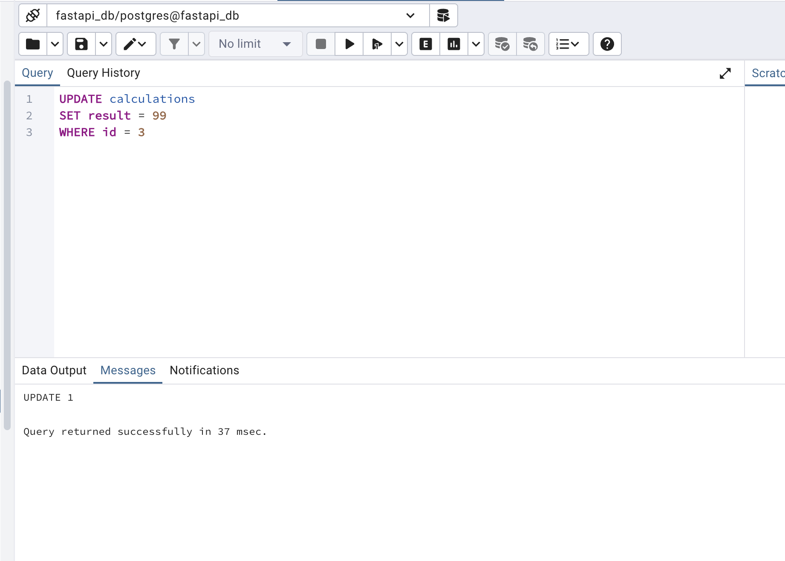

### After update

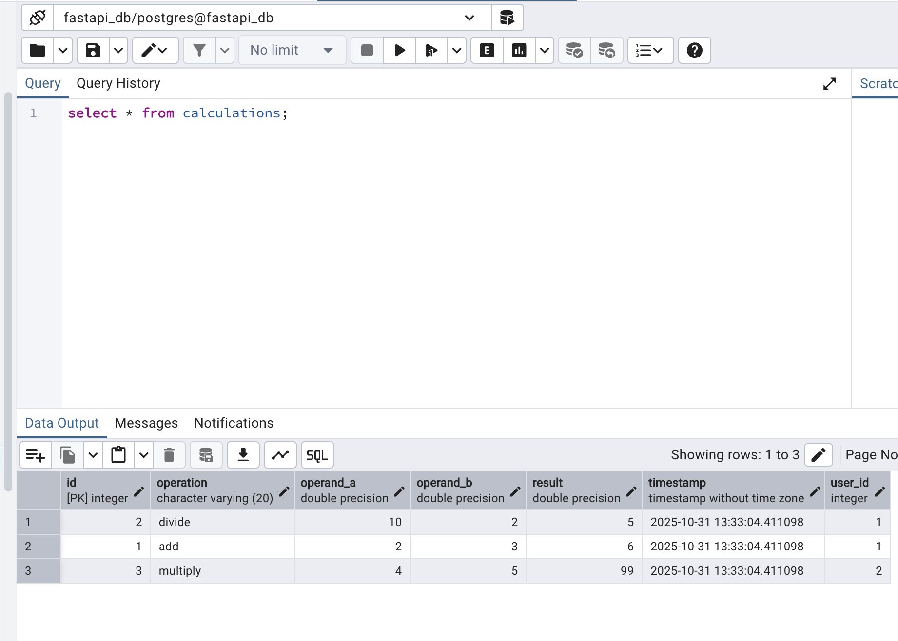

## Delete a record from calculation

- Deleted a specific record from the calculations table and verified it was successfully removed. 
- This confirms delete operations work correctly with the table’s relationships.
- As you can see ID=2 record is deleted.

Query:

```sql
DELETE FROM calculations
WHERE id = 2;  -- example record to remove
```

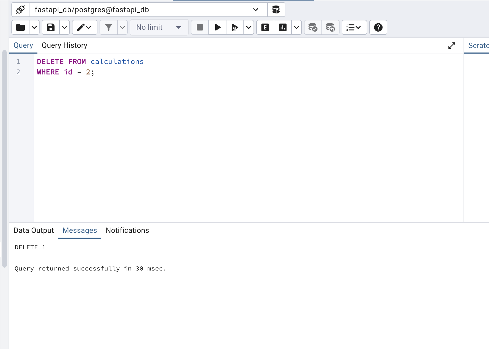

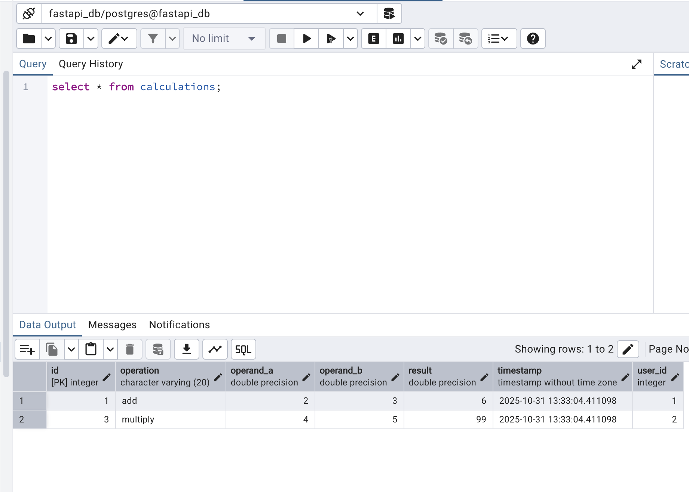

## Challanges

Faced one error while starting postgres docker container because of mounting path issue in updated postgres version. Fixed it by changing the path as recommended in error message.

